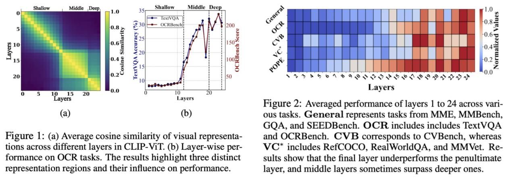

# Multimodal Language Models See Better When They Look Shallower

[](https://arxiv.org/abs/2504.21447)

## 📖 Introduction

Multimodal Large Language Models (MLLMs) usually rely on the last or penultimate layer of CLIP-ViT for visual inputs, forming a default **deep-layer-first paradigm**.  
But are deep features always optimal? Have the representational powers of shallow and middle layers been underestimated?

<div align="center">
  
  <p><em>Figure 1: Layer-wise visual feature analysis in CLIP-ViT</em></p>
</div>`

In this work, we analyze **layer-wise representational similarity** in CLIP-ViT and its correlation with downstream performance.  
- We clearly divide shallow, middle, and deep feature spaces.  
- Our study spans **models from 1.4B to 7B**, **datasets from 665K to 1M**, covering **10 benchmarks and 60+ tasks**.  

🔑 **Key Findings:**  
- **Deep features** → stronger in semantically intensive tasks (e.g., OCR).  
- **Shallow & middle features** → better for fine-grained perception tasks (counting, localization, object recognition).  
- A simple **cross-layer fusion method** effectively harnesses shallow and middle features, further validating their importance.


This work supports our main claim:  
**“Multimodal Language Models See Better When They Look Shallower.”**  
It also offers both theoretical foundations and practical guidelines for visual layer selection and fusion in future MLLMs.

---


## ✅ TODO List
- [ ] Release training & evaluation code
- [ ] Release training data json file splits
- [ ] Provide documentation & usage examples 


🚀 _Code will be released soon at_ 👉 [https://github.com/EIT-NLP/VisualProbing-for-MLLM](https://github.com/EIT-NLP/VisualProbing-for-MLLM)

---

## Installation

1. **Clone this repository and enter the directory**:
   ```bash
   git clone https://github.com/EIT-NLP/VisualProbing-for-MLLM
   cd MobileVLM
   ```

2. **Set up the Python environment and install requirements**:
   ```bash
   conda create -n mobilevlm python=3.10 -y
   conda activate mobilevlm
   pip install --upgrade pip
   pip install -r requirements.txt
   ```

---

## 🪜 Step-by-Step Tutorial

### 1. Prepare LLM and ViT Checkpoints

We provide support for three model scales:

- [MobileLLaMA-1.4B](https://huggingface.co/mtgv/MobileLLaMA-1.4B-Chat)
- [MobileLLaMA-2.7B](https://huggingface.co/mtgv/MobileLLaMA-2.7B-Base)
- [Vicuna-7B-v1.5](https://huggingface.co/lmsys/vicuna-7b-v1.5)
- [CLIP-ViT-Large-Patch14-336](https://huggingface.co/openai/clip-vit-large-patch14-336)

You can choose any scale. Below, we use the 1.4B model as an example.

---

### 2. Prepare Data

Our experiments use three data sizes:

- **Pre-training data**: llava-558K
- **Fine-tuning data**: llava-665K, Cambrian-737K, Costumed-1M

**Data sources:**

- [llava-558K and llava-665K datasets](https://github.com/haotian-liu/LLaVA?tab=readme-ov-file)
- [Cambrian-737K](https://huggingface.co/datasets/nyu-visionx/Cambrian-10M)
- [Costumed-1M (Baidu Cloud link)](https://pan.baidu.com/s/1gSXz_vgnZo9PWufASZYA8Q?pwd=8ptt)


### 3. Training

**Run the full training pipeline with one command:**
```bash
bash gpu_monitor.sh
```

- **To change the vision layer used for training:**  
  Edit the `mm_vision_select_layer` parameter in `run_layer18.sh`. Set to `-1` for the last layer, `-2` for the penultimate layer, and so on.

- **To switch the LLM or vision models:**  
  Modify the `LANGUAGE_MODEL` path in `gpu_monitor.sh` for your LLM, and set your vision encoder path in the `VISION_MODEL` variable.

**Training Stages:**

- **Stage I: Pre-training**
  - ❄️ Frozen vision encoder
  - 🔥 One-layer MLP projector
  - ❄️ Learnable LLM
  - Typical runtime: ~2 hours for 1.4B LLM on 4×A100 (80G), batch size 256.

- **Stage II: Multi-task Training**
  - ❄️ Frozen vision encoder
  - 🔥 One-layer MLP projector
  - 🔥 Learnable LLM
  - Typical runtime: ~8 hours for -1.4B LLM on 4×A100 (80G), batch size 128.


---

### 4. Evaluation

We utilize [lmms-eval](https://github.com/EvolvingLMMs-Lab/lmms-eval) for the evaluation process, and all related benchmark data can be found [here](https://huggingface.co/lmms-lab).

**Install lmms-eval:**
```bash
cd lmms-eval
pip install -e .
```

For [CV-Bench](https://huggingface.co/datasets/nyu-visionx/CV-Bench) evaluation, ChatGPT-4o or DeepSeek is required as the judge. In our experiments, we use the [DeepSeek API](https://www.deepseek.com) due to its lower cost and almost the same performance as ChatGPT-4o in this scenes.

**To run evaluation (make sure to set your checkpoint path in `eval_pipeline.sh`):**
```bash
cd eval_pipeline
bash eval_pipeline.sh
```


## Acknowledgments

We gratefully acknowledge the excellent work of the following codebases that our project builds upon:

- [**LLaVA**](https://github.com/haotian-liu/LLaVA)  
- [**MobileVLM**](https://github.com/Meituan-AutoML/MobileVLM)  

Thank you for your wonderful contributions! 👏

## 📚 Reference
```bibtex
@misc{chen2025multimodallanguagemodelsbetter,
      title={Multimodal Language Models See Better When They Look Shallower}, 
      author={Haoran Chen and Junyan Lin and Xinghao Chen and Yue Fan and Jianfeng Dong and Xin Jin and Hui Su and Jinlan Fu and Xiaoyu Shen},
      year={2025},
      eprint={2504.21447},
      archivePrefix={arXiv},
      primaryClass={cs.CV},
      url={https://arxiv.org/abs/2504.21447}, 
}
}
```